  

  

 

<table align="center">
<tr>
<td width="50%" valign="top">

### `⌁ WAZUH SIEM TUNING`
> **-80% de bruit** — ~1M → ~200K alertes/jour
> Custom detection rules & active response

`⟨ WAZUH ⟩` `⟨ DETECTION ⟩`

</td>
<td width="50%" valign="top">

### `⌁ CVE ALERT PIPELINE`
> Alerting **temps réel** CVSS ≥ 9
> Déduplication & active response Python

`⟨ PYTHON ⟩` `⟨ AUTOMATION ⟩`

</td>
</tr>
<tr>
<td width="50%" valign="top">

### `⌁ LLM SOC TRIAGE`
> Triage d'alertes **automatisé par IA**
> LLM local — Ollama / qwen2.5

`⟨ OLLAMA ⟩` `⟨ AI ⟩`

</td>
<td width="50%" valign="top">

### `⌁ FREYA // AI AGENT`
> Agent IA **autonome** self-hosted
> Architecture cron, self-model, VPS

`⟨ LLM ⟩` `⟨ LINUX ⟩`

</td>
</tr>
<tr>
<td width="50%" valign="top">

### `⌁ SOC STACK INTEGRATION`
> Wazuh + Suricata IDS + AI
> Règles custom validées end-to-end

`⟨ THEHIVE ⟩` `⟨ SURICATA ⟩`

</td>
<td width="50%" valign="top">

### `⌁ AD HARDENING`
> Score de risque **-50%** (PingCastle)
> GPO, PAM, Active Directory

`⟨ AD ⟩` `⟨ BLUE TEAM ⟩`

</td>
</tr>
</table>

 

  

  

  

  <code>// Contact Me</code>

